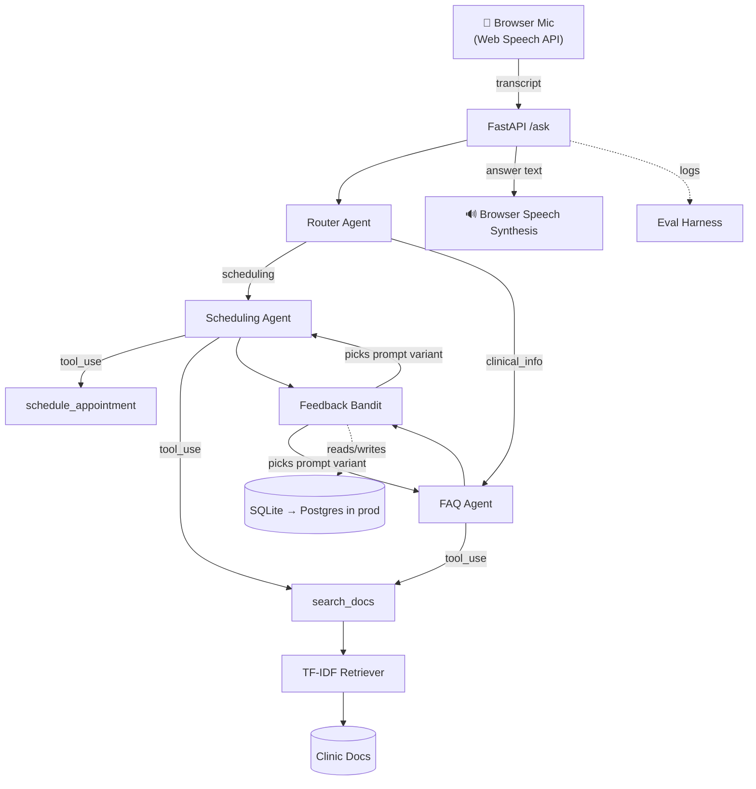

# Vox — Voice AI Clinic Copilot (POC)

A small, working demonstration of a **voice-enabled, multi-agent AI copilot
with a feedback loop that adapts over time** — built to mirror the stack in
a Senior AI Engineer (Voice AI & Agentic Systems) posting: production
voice AI agents, agentic workflows, evaluation infrastructure, and systems
that improve with every interaction.

## Why this exists

This demonstrates the specific pillars called out in that role: voice
input/output, multi-agent orchestration, tool calling, evaluation
infrastructure, and a lightweight adaptive feedback loop — in a small
footprint that's easy to read end to end rather than a black-box demo.

## Architecture



**Flow:** browser mic → transcript → `/ask` → **Router agent** classifies
intent → dispatches to the **Scheduling** or **FAQ** specialist agent →
that agent calls its tools (mock scheduler / RAG doc search) → answer
returned as text and spoken back via the browser → thumbs up/down feeds
into a **bandit** that shifts future prompt-variant selection per agent
based on real usage.

## What's in here

```
app/
  agents.py    # router + 2 specialist agents, tool-calling loop
  tools.py     # schedule_appointment (mock) + search_docs (RAG)
  rag.py       # TF-IDF retrieval over data/docs/*.txt
  feedback.py  # epsilon-greedy bandit over prompt variants
  db.py        # SQLite persistence (swap for Postgres in prod)
  config.py    # env-based config
api.py         # FastAPI: /ask, /feedback, serves the voice UI
static/index.html  # mic button + spoken response + thumbs feedback
eval/
  eval_questions.json  # 10 questions checking routing AND answer quality
  run_eval.py
scripts/quick_test.py  # sanity-checks RAG/tools/bandit, no API key needed
data/docs/     # clinic policy docs (scheduling, FAQ, visit types)
```

## Setup

```bash
pip install -r requirements.txt
cp .env.example .env   # fill in ANTHROPIC_API_KEY
```

**Test the local pieces first (no API key needed):**
```bash
python -m scripts.quick_test
```

**Run the voice UI:**
```bash
uvicorn api:app --reload
# open http://localhost:8000 in Chrome (Web Speech API support)
```
Hold the mic button, say something like *"I'd like to book an appointment
for Thursday, my name is Sam"* or *"What can you help me with?"* — Vox
routes it, calls the right tool, answers, and speaks the response back.
Use 👍/👎 to feed the bandit.

**Run the eval suite:**
```bash
python -m eval.run_eval
```
Checks both routing accuracy (did the right specialist handle it?) and
answer quality, and logs latency/tokens to `eval/results.csv`.

## Design choices, explained

- **Router + 2 specialist agents, not one giant prompt** — mirrors how a
  real multi-agent system decomposes responsibility (a "Scheduling" agent
  and a "Clinical FAQ" agent) rather than one model juggling every case in
  a single system prompt.
- **Web Speech API instead of a paid STT/TTS service** — zero external
  dependency, runs in any Chrome tab, and keeps the demo fully
  self-contained. Swap-in path to a production STT/TTS provider is below.
- **Epsilon-greedy bandit instead of full RLHF** — this is intentionally
  the smallest *honest* version of "the system improves with every
  interaction": it's a real online-learning mechanism (multi-armed
  bandit), not a placeholder, but it is not a full reinforcement-learning
  fine-tuning pipeline. That distinction matters and is worth being
  upfront about in an interview.
- **SQLite instead of PostgreSQL** — zero-setup locally; `app/db.py` is
  written so swapping to Postgres only touches the connection layer, not
  the schema or call sites.
- **Non-diagnostic content only** — the FAQ agent's docs and system
  prompt explicitly forbid diagnosis or medication guidance and redirect
  to a clinician, since this is an architecture demo, not a clinical
  product.

## Scaling this to production

| Area | POC (this repo) | Production |
|---|---|---|
| Voice I/O | Browser Web Speech API | Dedicated STT (Deepgram/Whisper) + TTS (ElevenLabs) with streaming, barge-in handling, and latency budgets |
| Retrieval | TF-IDF, in-memory | Vector DB + real embeddings, hybrid search, re-ranking |
| Orchestration | 2 specialist agents, plain router | Larger agent graph (LangGraph), shared state/memory across turns, escalation to a human |
| Feedback loop | Epsilon-greedy bandit on 2 prompt variants | Larger action space, contextual features, potentially full RLHF/DPO fine-tuning on collected preference data |
| Storage | SQLite | PostgreSQL, with proper migrations and connection pooling |
| Evaluation | 10 static questions, keyword + routing check | Larger labeled set, LLM-as-judge scoring, CI regression gating before deploy |
| Monitoring | None (POC scope) | Full request/tool-call/cost logging, alerting on latency/error/cost anomalies, sampled human review |
| Deployment | Local uvicorn | Containerized on AWS (ECS/Fargate), autoscaling, blue/green deploys, WebSocket streaming for real-time voice |
